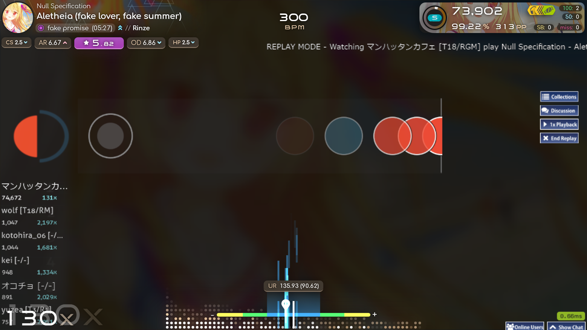
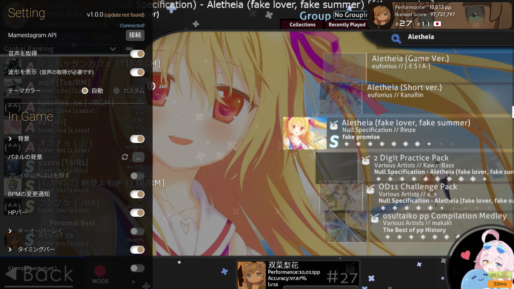
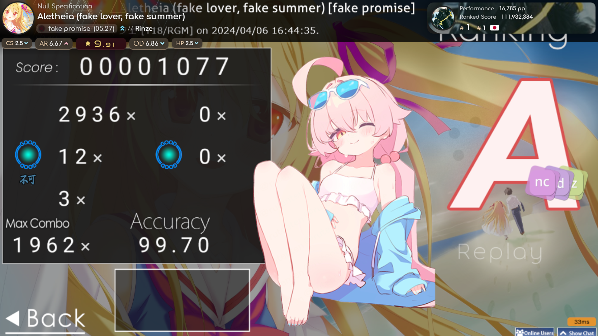
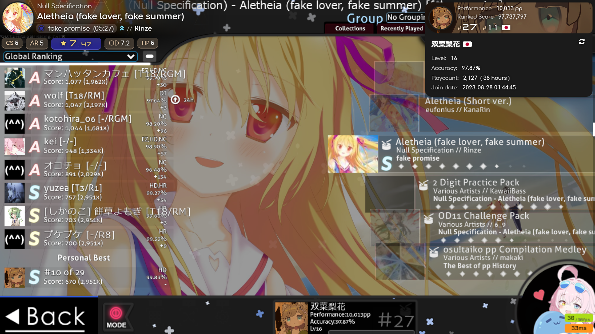

# paradox-mamesosu-overlay

 
 


日本語の説明は[こちら](./README_JP.md)

## Overview
This is a browser-based overlay that has been improved for use with the private server Mamestagram, and has various other features added!

Forked from: [Paradox Overlay](https://github.com/mofuries/paradox-osu-overlay)

## Difference from the original paradox
- Mamestagram server data is retrieved and displayed.
- When Bancho Mode is turned on, Bancho data is displayed. (API key is required)
- Unified code indentation
- UR notation (not only NM conversion but also UR display of DT)
- Added Mirror Mod for Mania
- Real-time SR display during play
- Support for Gosumemory (some functions limited version)

## How to use (with OBS Studio)
### What you need to install in advance (StreamCompanion version)
[OBS Studio (Open Broadcanst Software®)](https://obsproject.com/)

[StreamCompanion](https://github.com/Piotrekol/StreamCompanion)

### Procedure
1. [Download](https://github.com/mofuries/paradox-osu-overlay/archive/refs/heads/main.zip) the main unit, and change the **paradox** folder to **StreamCompanion** Move the **paradox** folder into the **StreamCompanion\Web\overlays** folder. It is OK if the folder looks like **StreamCompanion\Files\Web\overlays\paradox**.

2. Start OBS Studio, select Browser from Add Source, and enter [**http://localhost:20727/overlays/paradox/**](http://localhost:20727/overlays/paradox/) in the property URL. in the property URL.” Check “**OBS to control audio**”, “**Shut down source when not displayed**”, and “**Update browser display when scene is active**” and press OK to close properties.

3. Right-click on the browser you just added from within the source and select **Dialog** to open another window. Click in the window to bring up the settings window.

### What you need to install in advance (Gosumemory version)
[OBS Studio (Open Broadcanst Software®)](https://obsproject.com/)

[Gosumemory](https://github.com/l3lackShark/gosumemory)

[Node.js](https://nodejs.org/)

### Procedure
1. [Download](https://github.com/mofuries/paradox-osu-overlay/archive/refs/heads/main.zip) the main unit, and save the **paradox-gosumemory** folder in static/. Move the **paradox-gosumemory** folder into static/paradox-gosumemory. It should look like **static/paradox-gosumemory**.

2. Next, build the external PP Calculator. Install [Node.js](https://nodejs.org/) and execute the following command at the command prompt.
```bash
cd "path of installed folder/PP-Calculator"
npm install
````

3. Next, start PP Calculator.
```bash
node "PP Calculator.js"
````
or double click PP Calculator.js
Note that PP Calculator will close by itself if Gosumemory is not running.

4. Start OBS Studio, select “Browser” from “Add Source”, and add [**http://localhost:20727/overlays/paradox-gosumemory/**](http://localhost:20727/overlays/paradox-gosumemory/) in the property URL. Check “**OBS to control audio**”, “**Shut down source when not displayed**”, and “**Update browser display when scene is active**” and press OK to close properties.

5. Right-click on the browser you just added from within the source and select **Dialog** to open another window. Click in the window to bring up the settings window.

6. To retrieve user information, go to Settings and enter your osu! Username or ID in the “osu! Username or ID”

(If Bancho Mode is enabled, enter your Bancho username, if not, enter your Mamestagram username.)

## Support
If you have any questions, feel free to DM me on X(Overlay Dev: [(@mk_cou)](https://x.com/mk_cou), Mamestagram Stats: [(@Hoshino2__)](https://x.com/Hoshino2__)). However, please note that my English isn\'t very good, so I appreciate your understanding.
