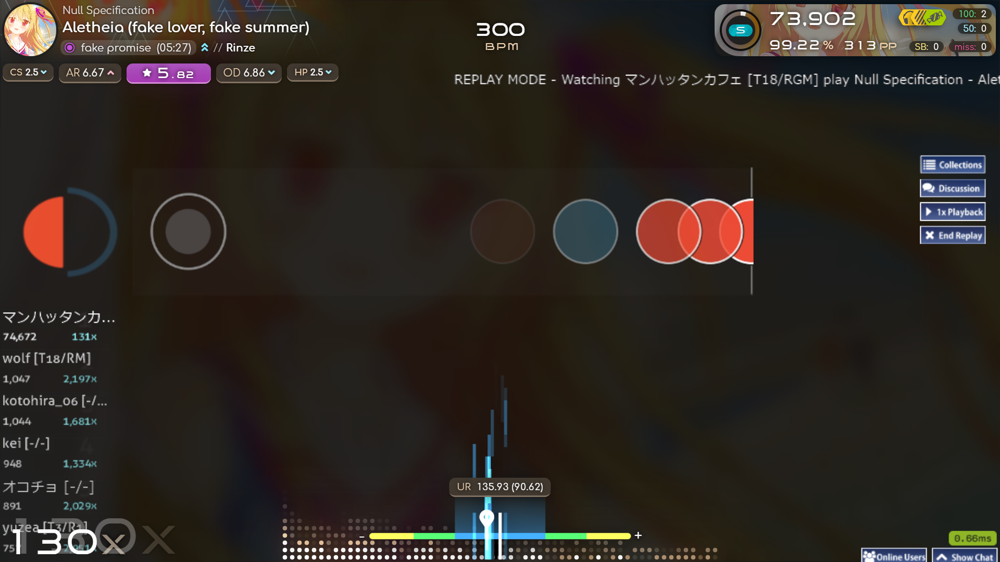
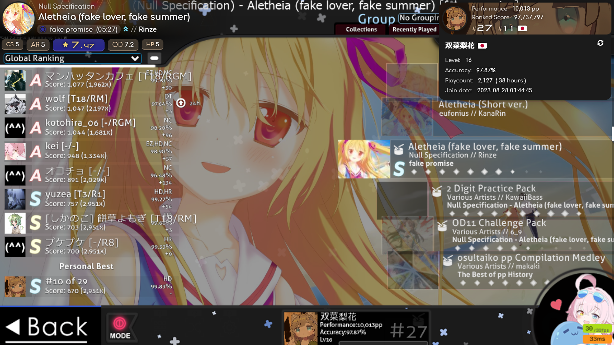

# paradox-mamesosu-overlay

 
 

## 概要
こちらはプライベートサーバー、Mamestagram専用に改良、その他様々な機能を追加したブラウザベースのオーバーレイです！

フォーク元: [Paradox Overlay](https://github.com/mofuries/paradox-osu-overlay)

## 本来のparadoxとの違い
- Mamestagramサーバーのデータを取得し表示。
- Bancho ModeをオンにするとBanchoのデータを表示します。(APIキーが必要です)
- コードのインデントを統一
- UR表記（NM変換だけでなく、DTのUR表示も）
- ManiaのMirror Modを追加
- プレイ中にリアルタイムSRを表示
- Gosumemoryに対応(一部機能制限版)

## 使用方法（OBS Studioを使用）
### 事前にインストールする必要があるもの (StreamCompanion版)
・[OBS Studio(Open Broadcanst Software®)](https://obsproject.com/)
・[StreamCompanion](https://github.com/Piotrekol/StreamCompanion)

### 手順
1.本体を[ダウンロード](https://github.com/mofuries/paradox-osu-overlay/archive/refs/heads/main.zip)し、**paradox**フォルダを **StreamCompanion\Files\Web\overlays** のなかに移動します。 **StreamCompanion\Files\Web\overlays\paradox** という風になっていれば大丈夫です。

2.OBS Studioを起動しソースの追加からブラウザを選択し、プロパティのURLに[**http://localhost:20727/overlays/paradox/**](http://localhost:20727/overlays/paradox/)を入力します。"**OBSで音声を制御する**"、"**表示されていないときにソースをシャットダウンする**"、"**シーンがアクティブになったときにブラウザの表示を更新する**"にチェックを入れOKを押してプロパティを閉じます。

3.ソース内から先ほど追加したブラウザを右クリックし、**対話**を選択すると別のウィンドウが開きます。ウィンドウ内をクリックすると設定画面が出てきます。

### 事前にインストールする必要があるもの (Gosumemory版)
・[OBS Studio(Open Broadcanst Software®)](https://obsproject.com/)
・[Gosumemory](https://github.com/l3lackShark/gosumemory)
・[Node.js](https://nodejs.org/)

### 手順
1.本体を[ダウンロード](https://github.com/mofuries/paradox-osu-overlay/archive/refs/heads/main.zip)し、**paradox-gosumemory**フォルダをstatic/paradox-gosumemoryのなかに移動します。 **static/paradox-gosumemory** という風になっていれば大丈夫です。

2.外付けのPP Calculatorを次にビルドします。[Node.js](https://nodejs.org/)をインストールし、コマンドプロンプトで以下のコマンドを実行します。
```bash
cd "インストールしたフォルダのパス/PP-Calculator"
npm install
```

3.次に、PP Calculatorを起動します。
```bash
node "PP Calculator.js"
```
か、そのまま"PP Calculator.js"をダブルクリックしても起動できます。Gosumemoryを起動していないと勝手に閉じてしまうので注意してください。

4.OBS Studioを起動しソースの追加からブラウザを選択し、プロパティのURLに[**http://localhost:20727/overlays/paradox-gosumemory/**](http://localhost:20727/overlays/paradox-gosumemory/)を入力します。"**OBSで音声を制御する**"、"**表示されていないときにソースをシャットダウンする**"、"**シーンがアクティブになったときにブラウザの表示を更新する**"にチェックを入れOKを押してプロパティを閉じます。

5.ソース内から先ほど追加したブラウザを右クリックし、**対話**を選択すると別のウィンドウが開きます。ウィンドウ内をクリックすると設定画面が出てきます。

6.ユーザー情報を取得するには、設定から"osu! Username or ID"にosu!のユーザー名またはIDを入力してください。

(Bancho Modeが有効ならBancho、無効ならMamestagramのユーザー情報を入力してください。)

## サポート
なにかあればX(オーバーレイ開発者: [(@mk_cou)](https://x.com/mk_cou), Mamestagram処理開発者: [(@Hoshino2__)](https://x.com/Hoshino2__))のDMでも受け付けてます。ただし英語は下手なのでそこはご了承ください。
